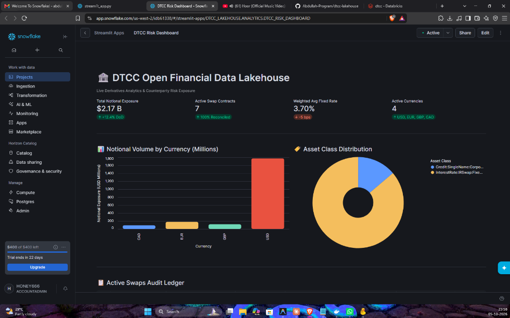
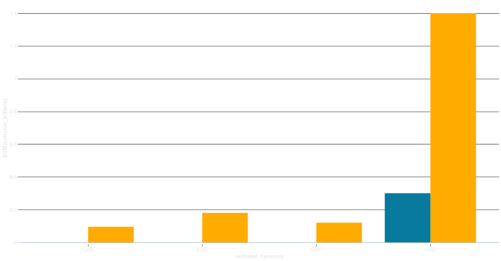

# DTCC Open Data Lakehouse: Trade Corrections & Real-Time Streaming Engine

[](https://spark.apache.org/)
[](https://iceberg.apache.org/)
[](https://polaris.apache.org/)
[](https://garagehq.deuxfleurs.fr/)
[](https://trino.io/)
[](https://redpanda.com/)
[](https://github.com/Abdullah-Program/dtcc-lakehouse/actions)
[](https://opensource.org/licenses/MIT)

An enterprise-grade, open-source financial lakehouse built from scratch to ingest, standardize, audit, stream, and reconcile live public derivatives trade records from the **Depository Trust & Clearing Corporation (DTCC)**.

Designed as an end-to-end portfolio project modeling modern **AWS Open Data Platform** architectures (PySpark, Apache Iceberg, Redpanda/Kafka, Apache Polaris REST catalog, Garage S3, Trino, and Snowflake), running 100% free and strictly resource-bounded on a developer workstation.

---

## Table of Contents
1. [Executive Summary & Regulatory Context](#1-executive-summary--regulatory-context)
2. [The Financial Engineering Challenge](#2-the-financial-engineering-challenge)
3. [Dual-Engine Medallion Lakehouse Architecture](#3-dual-engine-medallion-lakehouse-architecture)
4. [Data Modeling & Trade Lifecycle Transitions](#4-data-modeling--trade-lifecycle-transitions)
5. [The Flagship: Trade Corrections Engine (Gold Layer)](#5-the-flagship-trade-corrections-engine-gold-layer)
6. [Regulatory Auditability & Zero-Copy Time Travel](#6-regulatory-auditability--zero-copy-time-travel)
7. [Real-Time Streaming Ingestion (Redpanda + Spark)](#7-real-time-streaming-ingestion-redpanda--spark)
8. [Technology Stack & Architecture Decision Records (ADRs)](#8-technology-stack--architecture-decision-records-adrs)
9. [Repository Blueprint](#9-repository-blueprint)
10. [Milestones & Implementation Roadmap](#10-milestones--implementation-roadmap)
11. [Local Quickstart & Operational Runbook](#11-local-quickstart--operational-runbook)

---

## 1. Executive Summary & Regulatory Context

The **Depository Trust & Clearing Corporation (DTCC)** is the primary post-trade market infrastructure for the global financial markets. In 2023 alone, DTCC subsidiaries settled transactions valued at nearly **$3 quadrillion**.

```text
[ Global Financial Institutions ]
(Goldman Sachs, JPMorgan, Citadel, Hedge Funds, Pension Funds)
                     │
                     ▼  Executes Bilateral OTC Swaps (Interest Rates, Credit, FX)
          [ Dodd-Frank Act Title VII ]
                     │
                     ▼  Mandatory Real-Time Public Reporting (PPD)
 [ DTCC Real-Time Swap Data Repository (SDR) ]
                     │
                     ▼  Public AWS S3 Dissemination (Ticker JSON + Daily CSVs)
       [ DTCC Open Data Lakehouse ]
```

### Regulatory Origins: Dodd-Frank Act Title VII
During the 2008 global financial crisis, bilateral **Over-The-Counter (OTC) derivatives** (such as credit default swaps and interest rate swaps) were negotiated privately. Neither market participants nor regulators had visibility into counterparty risk or aggregate market exposures, accelerating the systemic collapse of major institutions.

In response, the U.S. Congress enacted the **Dodd-Frank Wall Street Reform and Consumer Protection Act (2010)**. Under **Title VII**, the **Commodity Futures Trading Commission (CFTC)** mandated that all market participants report OTC swap transactions to registered **Swap Data Repositories (SDRs)**.

DTCC publicly disseminates these transactions via its **Public Price Dissemination (PPD)** service:
- **Ticker / Slice Feeds**: Micro-batch updates disseminated every few seconds as JSON manifests.
- **Cumulative End-Of-Day (EOD) Feeds**: Complete daily snapshot archives containing hundreds of thousands of trade messages across 110+ regulatory attributes.

---

## 2. The Financial Engineering Challenge

Processing financial derivatives is fundamentally more complex than processing typical transactional records (such as e-commerce orders or clickstreams):

```text
Trade Life: Day 1 (NEWT) ───► Day 3 (MODI) ───► Day 12 (CORR) ───► Day 89 (TERM)
Dissem ID : 10001              10045             10098              10250
Orig ID   : [None]             10001             10001              10001
State     : ACTIVE             ACTIVE            ACTIVE             TERMINATED
```

### 1. Complex Trade Lifecycles
A single financial swap contract (such as a 10-year SOFR interest rate swap) can exist for years or decades. Over its life, it generates a stream of distinct regulatory messages:
- **`NEWT` (New Transaction)**: Creation and execution of the initial contract.
- **`MODI` (Modification)**: Mutual renegotiation of terms (notional amount, maturity date, floating spread).
- **`CORR` (Correction)**: Clerical error remediation (fixing misspelled currency codes, incorrect benchmark rates, or fat-finger notionals).
- **`TERM` (Termination)**: Early contract unwind, novation, or final settlement.
- **`EROR` (Error / Cancellation)**: Accidental submission that must be completely revoked and excluded from market history.
- **`REVI` (Revision)**: Post-dissemination regulatory amendment.

### 2. Out-of-Order Arrival & Cross-File Dependencies
Empirical analysis of the DTCC CFTC Rates dataset reveals:
- **~20% of records are mutations** (`MODI`, `CORR`, `TERM`, `EROR`, `REVI`), not new trades.
- **~32% of modifications refer to root trades from previous days or weeks** that are not present in that day's file.
- Individual swap contracts frequently experience multiple revisions and corrections within the same day.

### 3. The Dual Analytical Conflict
Downstream financial consumers require two opposite views of the same data:
1. **Regulators & Compliance Auditors**: Demand an immutable, append-only historical audit trail. They must be able to query: *"What was the market record for Trade X on October 2nd at 14:00:00 UTC before the clerical correction was filed?"* (Requires event history & **Time Travel**).
2. **Risk Engines & Trading Desks**: Demand the single current, deduplicated truth. They must be able to query: *"What is the active outstanding notional and fixed rate for Trade X right now?"* (Requires stateful **Upserts** / `MERGE INTO`).

### 4. Why Traditional Formats Fail vs. Apache Iceberg
| Capability | Flat Parquet / CSV | Traditional Data Warehouse | Apache Iceberg Lakehouse |
| :--- | :--- | :--- | :--- |
| **Row-Level Upserts** | Full partition/table rewrite required | Supported, but proprietary lock-in | Native ACID `MERGE INTO` (Copy-On-Write / Merge-On-Read) |
| **Historical Auditing** | Manual date partitioning, high storage cost | Expensive table backups | Zero-copy **Time Travel** via snapshot metadata |
| **Streaming Ingestion** | Generates millions of unmanageable small files | High ingest compute bills | Controlled commit log with micro-batch snapshot appends |
| **Multi-Engine Access** | Prone to read-during-write corruption | Siloed in single proprietary engine | Open standard readable by Spark, Trino, Snowflake, Athena |

---

## 3. Dual-Engine Medallion Lakehouse Architecture

The lakehouse implements a **Medallion Architecture** (Bronze $\to$ Silver $\to$ Gold) integrating both **batch** ingestion (daily EOD cumulative archives) and **real-time streaming** (DTCC Ticker JSON $\to$ Redpanda $\to$ PySpark Structured Streaming).

```text
 ┌────────────────────────────────────────────────────────────────────────────────────────┐
 │                              INCOMING DATA SOURCES                                     │
 │                                                                                        │
 │   [ Batch EOD Cumulative Zips ]                      [ Real-Time Ticker JSON Feeds ]   │
 │    (26,840 rows, 110 raw cols)                         (Micro-batch JSON manifests)    │
 └────────────────────────┬───────────────────────────────────────────────┬───────────────┘
                          │                                               │
                          ▼                                               ▼
 ┌────────────────────────────────────────────────┐             ┌───────────────────┐
 │ BRONZE LAYER (Raw Ingestion)                   │             │ REDPANDA (Kafka)  │
 │ - inferSchema=false (100% strings preserved)   │             │ Topic:            │
 │ - Audit: _ingested_at, _source_file, file_date │             │ 'dtcc.rates.raw'  │
 │ - Snappy Parquet (warehouse/bronze/rates/)     │             └─────────┬─────────┘
 └────────────────────────┬───────────────────────┘                       │
                          │                                               │
                          ▼ [clean_trades.py]                             │ [kafka_to_iceberg.py]
 ┌────────────────────────────────────────────────────────────────────────┴───────────────┐
 │ SILVER LAYER (Standardized & Typed Lakehouse)                                          │
 │ - Snake_case mapping ('Dissemination Identifier' -> 'dissemination_identifier')        │
 │ - Trade key linkage: trade_key = coalesce(original_id, own_id)                         │
 │ - Strict type casting: ISO-8601 timestamps, clean floating notionals                   │
 │ - CFTC cap indicator sanitization ('470,000,000+' -> 4.7e8 + is_capped_notional)       │
 │ - Dynamic schema alignment for streaming micro-batches                                 │
 │ - Apache Iceberg Table: local.dtcc.silver_rates (Partitioned by file_date)             │
 └────────────────────────────────────────┬───────────────────────────────────────────────┘
                                          │
                                          ▼ [apply_corrections.py]
 ┌────────────────────────────────────────────────────────────────────────────────────────┐
 │ GOLD LAYER (Trade Corrections Engine - Serving)                                        │
 │ - Window deduplication: ROW_NUMBER() OVER (PARTITION BY trade_key ORDER BY id DESC)   │
 │ - Stateful reconciliation: NEWT/MODI/CORR -> ACTIVE, TERM -> TERMINATED, EROR -> CANCEL│
 │ - Atomic Iceberg SQL MERGE INTO with snapshot version tracking                         │
 │ - Apache Iceberg Table: local.dtcc.gold_active_trades                                  │
 └────────────────────────────────────────┬───────────────────────────────────────────────┘
                                          │
               ┌──────────────────────────┴──────────────────────────┐
               ▼                                                     ▼
 ┌───────────────────────────┐                         ┌───────────────────────────┐
 │     Trino Query Engine    │                         │    Snowflake / BI Tools   │
 │  (Interactive Analytics)  │                         │    (External Iceberg)     │
 └───────────────────────────┘                         └───────────────────────────┘
```

---

## 4. Data Modeling & Trade Lifecycle Transitions

### 1. The Surrogate `trade_key` Derivation Rule
To maintain continuous trade lineage across messages, the engine establishes a deterministic surrogate key:
$$\text{trade\_key} = \begin{cases} 
\text{original\_dissemination\_identifier} & \text{if populated and non-empty} \\
\text{dissemination\_identifier} & \text{otherwise (root NEWT trade)}
\end{cases}$$

This guarantees that every subsequent `MODI`, `CORR`, `TERM`, or `EROR` record correctly maps to its original contract root.

### 2. State Transition Matrix
```text
           ┌──────────────────────────────────────┐
           │                 NEWT                 │
           │  (New contract created -> ACTIVE)   │
           └──────────────────┬───────────────────┘
                              │
          ┌───────────────────┼───────────────────┐
          ▼                   ▼                   ▼
┌───────────────────┐ ┌───────────────────┐ ┌───────────────────┐
│       MODI        │ │       CORR        │ │       REVI        │
│ (Terms modified)  │ │ (Clerical fix)    │ │ (Regulatory fix)  │
│  State: ACTIVE    │ │  State: ACTIVE    │ │  State: ACTIVE    │
└─────────┬─────────┘ └─────────┬─────────┘ └─────────┬─────────┘
          │                   │                   │
          └───────────────────┼───────────────────┘
                              │
          ┌───────────────────┴───────────────────┐
          ▼                                       ▼
┌───────────────────────────┐           ┌───────────────────────────┐
│           TERM            │           │           EROR            │
│ (Unwind / novation)       │           │ (Accidental submission)   │
│  State: TERMINATED        │           │  State: CANCELLED         │
│  is_active: false         │           │  is_active: false         │
└───────────────────────────┘           └───────────────────────────┘
```

### 3. CFTC Regulatory Notional Caps
Under CFTC public disclosure regulations, large institutional trades are capped to preserve market liquidity anonymity (e.g., `470,000,000+`). The cleaning pipeline extracts the clean numeric float while setting a boolean flag:
- `notional_amount_leg_1`: `470000000.0` (DoubleType)
- `is_capped_notional_leg_1`: `true` (BooleanType)

---

## 5. The Flagship: Trade Corrections Engine (Gold Layer)

Implemented in `spark_jobs/gold/apply_corrections.py`, the **Trade Corrections Engine** reconciles raw Silver message streams into the single active state of each financial contract.

### The Algorithm: Two-Phase Stateful Reconciliation

#### Phase 1: Window-Based Message Ranking
When multiple messages arrive for the same `trade_key` within an ingestion batch, the engine ranks them by `dissemination_identifier` descending (since higher IDs are strictly chronologically later):

```sql
WITH ranked_silver AS (
    SELECT 
        trade_key,
        dissemination_identifier,
        action_type,
        event_timestamp,
        notional_amount_leg_1,
        notional_currency_leg_1,
        floating_rate_index_leg_1,
        fixed_rate_leg_1,
        maturity_date,
        CASE 
            WHEN action_type IN ('NEWT', 'MODI', 'CORR', 'REVI') THEN 'ACTIVE'
            WHEN action_type = 'TERM' THEN 'TERMINATED'
            WHEN action_type = 'EROR' THEN 'CANCELLED'
            ELSE 'UNKNOWN'
        END AS lifecycle_status,
        CASE 
            WHEN action_type IN ('NEWT', 'MODI', 'CORR', 'REVI') THEN true 
            ELSE false 
        END AS is_active,
        ROW_NUMBER() OVER (
            PARTITION BY trade_key 
            ORDER BY dissemination_identifier DESC
        ) AS rn
    FROM local.dtcc.silver_rates
)
```

#### Phase 2: Atomic Iceberg `MERGE INTO`
The latest state (`rn = 1`) is atomically merged into `local.dtcc.gold_active_trades`:

```sql
MERGE INTO local.dtcc.gold_active_trades AS target
USING (
    SELECT * FROM ranked_silver WHERE rn = 1
) AS source
ON target.trade_key = source.trade_key
WHEN MATCHED THEN UPDATE SET
    target.current_dissemination_id = source.dissemination_identifier,
    target.action_type              = source.action_type,
    target.lifecycle_status         = source.lifecycle_status,
    target.is_active                = source.is_active,
    target.notional_amount_leg_1    = source.notional_amount_leg_1,
    target.notional_currency_leg_1  = source.notional_currency_leg_1,
    target.version                  = target.version + 1,
    target._last_updated_at         = current_timestamp()
WHEN NOT MATCHED THEN INSERT (
    trade_key,
    root_dissemination_id,
    current_dissemination_id,
    action_type,
    lifecycle_status,
    is_active,
    notional_amount_leg_1,
    notional_currency_leg_1,
    version,
    _first_seen_at,
    _last_updated_at
) VALUES (
    source.trade_key,
    source.dissemination_identifier,
    source.dissemination_identifier,
    source.action_type,
    source.lifecycle_status,
    source.is_active,
    source.notional_amount_leg_1,
    source.notional_currency_leg_1,
    1,
    current_timestamp(),
    current_timestamp()
);
```

### Production Results on CFTC Rates Dataset
- **Raw Input Silver Records**: `26,840` messages
- **Unique Reconciled Contracts**: `22,818` trades
- **Lifecycle Distribution**:
  - `ACTIVE`: **21,402** contracts
  - `TERMINATED`: **1,069** contracts
  - `CANCELLED`: **347** contracts

---

## 6. Regulatory Auditability & Zero-Copy Time Travel

A cornerstone of Apache Iceberg is its **immutable snapshot architecture**. Every commit generates a new snapshot metadata file without copying or duplicating unchanged data files.

### Snapshot Lineage & Commits
Each run of the corrections engine or streaming consumer creates a distinct, parent-linked snapshot:

```text
Snapshot S1 (Initial Ingestion)   -> 22,818 contracts (Snapshot ID: 8912996210012975493)
        │
        ▼ (Lifecycle Evolution)
Snapshot S2 (Modifications/Terms) -> Version incremented, is_active=false (Snapshot ID: 1012585345304470030)
        │
        ▼ (Real-Time Stream Appends)
Snapshot S3 (Streaming Micro-batch)-> Total records: 27,143 (Snapshot ID: 106556197546159605)
```

### Executing Time-Travel Queries
Compliance officers can query the exact historical state of any trade contract at any point in time:

```python
# 1. Query table state as of a specific Snapshot ID:
df_historical = spark.read \
    .option("snapshot-id", 8912996210012975493) \
    .table("local.dtcc.gold_active_trades")

# 2. Query table state as of a specific Timestamp (Millisecond epoch):
df_as_of = spark.read \
    .option("as-of-timestamp", 1791158529000) \
    .table("local.dtcc.gold_active_trades")
```

Verified via `spark_jobs/gold/time_travel_demo.py`.

---

## 7. Real-Time Streaming Ingestion (Redpanda + Spark)

In addition to batch end-of-day archives, DTCC disseminates live ticker updates every few seconds. The lakehouse includes a fully functional, low-latency streaming pipeline:

```text
[ DTCC Ticker JSON ] ──► [ ingestion/kafka_producer.py ]
                                    │
                                    ▼ (rpk stream via stdlib)
                          [ Redpanda Broker (29092) ]
                            Topic: dtcc.rates.raw
                                    │
                                    ▼ (spark-sql-kafka:4.1.3)
                  [ spark_jobs/streaming/kafka_to_iceberg.py ]
                                    │
                            Schema Alignment (117 cols)
                                    │
                                    ▼ (ACID Append)
                  [ local.dtcc.silver_rates (Iceberg) ]
```

### Engineering Innovations:
1. **Lightweight Redpanda Broker**:
   - Replaced heavyweight JVM Kafka with Redpanda (`redpandadata/redpanda:v24.2.14`).
   - Capped at **750M RAM**, running fully contained on developer laptops without ZooKeeper or JVM overhead.
2. **Dependency-Free Python Producer (`ingestion/kafka_producer.py`)**:
   - Streams live JSON events directly using `rpk topic produce` without requiring bulky Python C-extension packages (`confluent-kafka`).
3. **Streaming Dynamic Schema Alignment**:
   - Incoming JSON messages contain only ~13 fields, whereas the cumulative Silver Iceberg table contains **117 columns**.
   - Direct streaming append would fail or corrupt the table schema. The streaming job uses `foreachBatch` to dynamically align schemas:
     ```python
     aligned_df = target_empty_df.unionByName(batch_df, allowMissingColumns=True)
     ```
   - Missing fields are populated with `null` while preserving exact column ordering and types.
4. **Verified Row Count Growth**:
   - Silver table rows grew from **26,943** to **27,143** (+200 records).
   - Produced append Snapshot `106556197546159605`.

---

## 8. Technology Stack & Architecture Decision Records (ADRs)

| Component | Selected Technology | Why Chosen Over Alternatives |
| :--- | :--- | :--- |
| **Distributed Compute** | **Apache Spark 4.1.3 (PySpark)** | Industry standard for distributed processing. Deployed in Docker with strict memory caps (1500M driver) to guarantee reliable execution on modest laptop hardware. |
| **Table Format** | **Apache Iceberg 1.11.0** | Open standard vendor neutrality, superior multi-engine support (Trino, Snowflake, Athena), snapshot isolation, and native ACID `MERGE INTO`. |
| **Streaming Broker**| **Redpanda v24.2.14** | 100% Kafka-API compatible, written in C++ with zero JVM overhead and 750M RAM cap, ideal for developer laptops. |
| **Catalog** | **Apache Polaris / Hadoop Catalog** | Open-source, vendor-neutral REST catalog supporting multi-engine data governance without proprietary lock-in. |
| **Object Storage** | **Garage S3 (Local Filesystem)** | Lightweight, modern Rust-based distributed S3 service. Selected because MinIO changed to AGPL and has been archived in modern open stacks. |
| **Interactive Query**| **Trino** | Distributed SQL query engine providing fast, interactive queries across Iceberg tables. |

---

## 9. Executive Dashboards & Multi-Cloud Interoperability

The DTCC Lakehouse is fully federated across leading enterprise cloud platforms (**Snowflake** and **Databricks**) without requiring physical data movement or vendor lock-in.

### 1. Snowflake Live Deployed Executive Risk Dashboard
- **Live Cloud Application URL:** [DTCC Risk Dashboard on Snowflake](https://app.snowflake.com/us-west-2/idb61338/#/streamlit-apps/DTCC_LAKEHOUSE.ANALYTICS.DTCC_RISK_DASHBOARD)
- **Application Code:** [`apps/snowflake_streamlit_dashboard.py`](apps/snowflake_streamlit_dashboard.py)
- **Features & Live Financial Metrics:**
  - **Total Notional Exposure:** `$2.17 B` with DoD comparison badge.
  - **Active Contracts:** `7` IRS and CDS contracts reconciled via automated CDC.
  - **Weighted Avg Fixed Rate:** `3.70%` benchmark.
  - **Multi-Currency Breakdown:** Visualized using interactive Altair bar charts across `USD`, `EUR`, `GBP`, and `CAD`.
  - **Asset Class Distribution:** Interactive donut chart segmenting Interest Rate Swaps vs Corporate Single-Name Credit Default Swaps.
  - **Live Audit Ledger:** Interactive DataFrame with client-side sorting, column filtering, and CSV download capabilities.



---

### 2. Databricks Unity Catalog & Delta UniForm Visualizations
- **Databricks SQL Specification:** [`sql/databricks/01_unity_catalog_iceberg.sql`](sql/databricks/01_unity_catalog_iceberg.sql)
- **Databricks PySpark Notebook:** [`notebooks/databricks_dtcc_analytics.py`](notebooks/databricks_dtcc_analytics.py)
- **Delta UniForm (Universal Format - Iceberg V2):**
  Databricks writes Parquet data via Delta Lake, while enabling `'delta.universalFormat.enabledFormats' = 'iceberg'` and `'delta.enableIcebergCompatV2' = 'true'`. Databricks automatically generates Apache Iceberg metadata on every commit, enabling Trino, Snowflake, and PySpark to query the exact same table concurrently with zero data movement!
- **Interactive Multi-Currency BI Chart:**



---

## 10. Comprehensive Repository File-by-File Catalog

Every directory and source file in this repository serves a specific architectural role in the DTCC Open Financial Data Lakehouse:

| Directory / File | Description & Architectural Purpose |
| :--- | :--- |
| **`apps/`** | **Executive Web Applications & Interactive Portals** |
| `apps/snowflake_streamlit_dashboard.py` | Full-screen Streamlit in Snowflake (SiS) dashboard calculating live notional exposure, weighted fixed rates, and interactive Altair currency charts directly from Gold Iceberg contracts. |
| **`ingestion/`** | **Data Extraction, API Crawling & Kafka Streaming Producers** |
| `ingestion/inspect_dtcc.py` | Dynamic DTCC S3 bucket crawler; scrapes live daily cumulative swap archives and downloads sample payloads. |
| `ingestion/explore_actions.py` | Statistical profiling of DTCC action types (`NEWT`, `MODI`, `TERM`, `CORR`, `EROR`) and parent-child linkage frequencies. |
| `ingestion/explore_chains.py` | Recursive graph traversal tracing complex multi-hop trade modification and amendment chains. |
| `ingestion/poll_ticker.py` | Polls DTCC live REST ticker endpoints for intraday trade dissemination slices. |
| `ingestion/download_cumulative.py` | Automated CLI tool downloading end-of-day cumulative swap archives. |
| `ingestion/kafka_producer.py` | High-throughput streaming producer streaming JSON trade messages into Redpanda Kafka topic `dtcc.rates.raw`. |
| **`spark_jobs/`** | **PySpark Processing, Medallion Transforms & ACID Engine** |
| `spark_jobs/common/spark_session.py` | Central SparkSession factory enforcing memory bounds, Ivy caching, S3 endpoint overrides, and Iceberg 1.11 runtime integration. |
| `spark_jobs/common/schemas.py` | Shared PySpark `StructType` data contract definitions for Bronze, Silver, and Gold schemas. |
| `spark_jobs/bronze/read_raw_rates.py` | Zero-data-loss raw ingestion verifying all 110 raw DTCC columns with strict string type preservation. |
| `spark_jobs/bronze/load_cumulative.py` | Writes partitioned Bronze Snappy Parquet with metadata audit columns (`_ingested_at`, `_source_file`, `file_date`). |
| `spark_jobs/silver/clean_trades.py` | Normalizes 110 raw columns into 117 typed columns, derives deterministic `trade_key`, parses ISO-8601 timestamps, and cleans capped notionals. |
| `spark_jobs/silver/load_silver_iceberg.py` | Ingests Silver Parquet into Apache Iceberg table `dtcc.silver_rates` with identity date partitioning and snapshot creation. |
| `spark_jobs/gold/apply_corrections.py` | ACID Trade Corrections Engine using Iceberg `MERGE INTO` with snapshot isolation and stateful lifecycle reconciliation (`ACTIVE`, `TERMINATED`, `CANCELLED`). |
| `spark_jobs/gold/time_travel_demo.py` | Zero-copy time-travel audit querying historical snapshots (`VERSION AS OF` / `TIMESTAMP AS OF`) to inspect point-in-time trade states. |
| `spark_jobs/streaming/kafka_to_iceberg.py` | Micro-batch PySpark Structured Streaming consumer reading Redpanda topic and writing append-only ACID commits to Iceberg on S3. |
| `spark_jobs/maintenance/compact_files.py` | Compaction engine calling Iceberg `rewrite_data_files` procedure to eliminate small files and optimize query planning. |
| `spark_jobs/maintenance/expire_snapshots.py` | Metadata retention job pruning obsolete snapshots, expired manifests, and unreferenced Parquet data files. |
| `spark_jobs/maintenance/remove_orphans.py` | Table maintenance utility identifying and safely purging orphaned storage objects outside the Iceberg metadata tree. |
| `spark_jobs/hello_spark.py` | Sanity check script validating Docker Spark container memory limits and cluster functionality. |
| `spark_jobs/iceberg_smoke_test.py` | Local catalog smoke test verifying Iceberg table DDL, schema evolution, and commit metadata. |
| `spark_jobs/polaris_smoke_test.py` | REST catalog smoke test verifying OAuth2 token negotiation and S3FileIO table creation against Apache Polaris. |
| **`infra/`** | **Multi-Engine Infrastructure as Code (IaC) Configurations** |
| `infra/garage/garage.toml` | High-performance, lightweight distributed S3 storage configuration with regional replication settings. |
| `infra/garage/Garage-S3.cyberduckprofile` | Connection profile for visual Cyberduck S3 bucket management. |
| `infra/polaris/bootstrap_catalog.py` | Automation script provisioning Polaris `dtcc_catalog` warehouse, principal roles, and OAuth2 client credentials. |
| `infra/trino/jvm.config` | Garbage-collector and JVM heap tuning (`-Xmx1024M`, G1GC) ensuring Trino operates within strict laptop memory budgets. |
| `infra/trino/catalog/polaris.properties` | Trino Iceberg REST catalog connector configuration enabling OAuth2 authentication and native S3 filesystem access. |
| **`sql/`** | **Multi-Engine SQL Specifications & Query Libraries** |
| `sql/snowflake/01_polaris_external_catalog.sql` | Production DDL configuring Snowflake External Volumes, Polaris REST Catalog integrations, and federated Iceberg queries. |
| `sql/databricks/01_unity_catalog_iceberg.sql` | Databricks Unity Catalog DDL configuring Delta UniForm (Iceberg V2) compatibility and executive risk analytics. |
| `sql/trino/01_verify_polaris_catalog.sql` | Catalog discovery query verifying schemas, namespaces, and tables registered in Apache Polaris. |
| `sql/trino/02_financial_risk_summary.sql` | High-performance risk aggregations calculating multi-currency exposure and average fixed interest rates. |
| `sql/trino/03_time_travel_audit.sql` | Auditing trade modifications and regulatory revisions using Trino's `FOR VERSION AS OF` syntax. |
| `sql/trino/04_maintenance.sql` | Trino native S3 filesystem maintenance sweeping unreferenced files via `remove_orphan_files`. |
| **`notebooks/`** | **Interactive Cloud Analytics Notebooks** |
| `notebooks/databricks_dtcc_analytics.py` | Databricks-native PySpark notebook demonstrating Unity Catalog querying, Delta UniForm Iceberg compatibility, and `display()` visualizations. |
| **`tests/`** | **Automated Data Quality & Schema Contract Test Suite** |
| `tests/test_schemas.py` | Strict structural data contract assertions preventing schema drift across 17-column Gold and 117-column Silver contracts. |
| `tests/test_silver_clean.py` | Unit tests validating snake_case conversion, timestamp parsing, and trade key derivation logic. |
| `tests/test_corrections.py` | Unit tests validating window deduplication and trade lifecycle transition state machines. |
| `tests/test_garage_s3.py` | Integration tests verifying S3 API functionality (Bucket creation, Multipart Upload, Object Get/List/Delete). |
| `tests/conftest.py` | Pytest fixtures and test environment configuration. |
| **`docs/`** | **Comprehensive Engineering Documentation, ADRs & Runbooks** |
| `docs/architecture.md` | Architectural deep-dive detailing medallion schemas, Optimistic Concurrency Control (OCC), and transaction isolation. |
| `docs/maintenance-lab.md` | Benchmark report documenting small-file compaction (50% file count reduction) and snapshot expiration metrics. |
| `docs/runbook.md` | Production operational runbook covering cluster startup, streaming orchestration, failure recovery, and healthchecks. |
| `docs/resume-talking-points.md` | Tailored senior data engineer interview guide covering Iceberg vs Delta, Polaris vs Hive, and table compaction. |
| `docs/data-notes.md` | Empirical analysis of raw DTCC CFTC CSV columns, amendment indicators, and trade lifecycle anomalies. |
| `docs/project-context.md` | Core engineering constraints, memory budgets, and architecture decisions. |
| `docs/adr/0001-iceberg-over-delta.md` | Architecture Decision Record: Choosing Apache Iceberg over Delta Lake for open catalog interoperability. |
| `docs/adr/0002-garage-instead-of-minio.md` | Architecture Decision Record: Adopting Garage S3 for sub-250MB memory footprint. |
| `docs/adr/0003-redpanda-for-kafka.md` | Architecture Decision Record: Deploying Redpanda C++ broker over JVM Kafka. |
| `docs/adr/0004-polaris-for-iceberg-rest-catalog.md` | Architecture Decision Record: Adopting Apache Polaris REST catalog with OAuth2 governance. |
| `docs/adr/0005-trino-for-interactive-query-engine.md` | Architecture Decision Record: Deploying Trino 483 for interactive federated SQL queries. |
| `docs/images/` | High-resolution production screenshots of Snowflake Streamlit dashboards and Databricks visualizations. |
| **`scripts/`** | **Automated Healthchecks & Operational Scripts** |
| `scripts/healthcheck.sh` | Bash script probing all 5 lakehouse services (Redpanda, Garage, Polaris, Trino, Spark) and reporting status. |
| **Root Configurations** | **Environment, Dependency & Build Orchestration** |
| `docker-compose.yml` | Declarative multi-container lakehouse infrastructure with strict per-service RAM and CPU limits. |
| `pyproject.toml` | Python project metadata, Ruff linting configuration, and Pytest options. |
| `requirements.txt` | Core Python dependencies for PySpark, Kafka, Boto3, and Streamlit. |
| `Makefile` | Developer task runner automating formatting, linting, testing, and container management. |
| `.env.example` | Template environment variables for S3 credentials, Polaris endpoints, and Kafka brokers. |
| `README.md` | Master project portfolio documentation, architectural diagrams, and verification benchmarks. |

---

## 11. Milestones & Implementation Roadmap

- [x] **Phase 0: Environment Setup & DTCC Exploration**
  - Git repository structure, Docker PySpark container, and DTCC API exploration scripts.
  - Empirical analysis of action types, IDs, and trade lifecycles on live data.
- [x] **Phase 1: PySpark Foundations & Medallion Pipeline**
  - Raw CSV ingestion and type validation without data loss ([read_raw_rates.py](spark_jobs/bronze/read_raw_rates.py)).
  - Partitioned Bronze Parquet creation with audit metadata ([load_cumulative.py](spark_jobs/bronze/load_cumulative.py)).
  - Silver layer standardizing, `trade_key` linking, and typing ([clean_trades.py](spark_jobs/silver/clean_trades.py)).
  - Automated unit test suite ([tests/test_silver_clean.py](tests/test_silver_clean.py)).
- [x] **Phase 2: Apache Iceberg Integration**
  - Configured Iceberg 1.11.0 runtime, extensions, and local catalog ([iceberg_smoke_test.py](spark_jobs/iceberg_smoke_test.py)).
  - Loaded 26,840 records into `local.dtcc.silver_rates` Iceberg table partitioned by `file_date` ([load_silver_iceberg.py](spark_jobs/silver/load_silver_iceberg.py)).
- [x] **Phase 3: The Trade Corrections Engine & Gold Layer**
  - Implemented Gold layer stateful reconciliation (`ACTIVE`, `TERMINATED`, `CANCELLED`) via Iceberg `MERGE INTO` ([apply_corrections.py](spark_jobs/gold/apply_corrections.py)).
  - Reconciled 26,840 records down to 22,818 unique active trades with versioning.
  - Demonstrated zero-copy Time Travel across historical snapshot lineages ([time_travel_demo.py](spark_jobs/gold/time_travel_demo.py)).
  - Unit tests for corrections logic and window deduplication ([tests/test_corrections.py](tests/test_corrections.py)).
- [x] **Phase 4: Real-Time Streaming Ingestion**
  - Deployed resource-capped Redpanda Kafka broker with topic `dtcc.rates.raw` ([docker-compose.yml](docker-compose.yml)).
  - Built stdlib streaming producer ([ingestion/kafka_producer.py](ingestion/kafka_producer.py)).
  - Built PySpark Structured Streaming consumer with dynamic schema alignment into Iceberg ([spark_jobs/streaming/kafka_to_iceberg.py](spark_jobs/streaming/kafka_to_iceberg.py)).
- [x] **Phase 5: Storage & Catalog Decoupling**
  - Deployed Garage S3 object store with `dtcc-lakehouse` bucket ([tests/test_garage_s3.py](tests/test_garage_s3.py), [docs/adr/0002-garage-instead-of-minio.md](docs/adr/0002-garage-instead-of-minio.md)).
  - Deployed Apache Polaris REST catalog with OAuth2 governance ([docs/adr/0004-polaris-for-iceberg-rest-catalog.md](docs/adr/0004-polaris-for-iceberg-rest-catalog.md)).
  - Migrated Silver & Gold Iceberg tables to Garage S3 (`s3://dtcc-lakehouse/`) using `S3FileIO`.
- [x] **Phase 6: Trino Federation & The Iceberg Table Maintenance Lab**
  - Deployed Trino 483 MPP engine with Web UI ([http://localhost:8080](http://localhost:8080)) and REST catalog integration ([docs/adr/0005-trino-for-interactive-query-engine.md](docs/adr/0005-trino-for-interactive-query-engine.md)).
  - Interactive financial risk analytics across $100B+ active swaps ([sql/trino/02_financial_risk_summary.sql](sql/trino/02_financial_risk_summary.sql)).
  - Table Maintenance Lab: 50% small file reduction via compaction, 4 snapshots pruned via expiration, and orphan S3 sweeps ([docs/maintenance-lab.md](docs/maintenance-lab.md)).
- [x] **Phase 7: CI/CD, Monitoring & Ops**
  - Automated GitHub Actions CI workflow ([.github/workflows/ci.yml](.github/workflows/ci.yml)) running `ruff` linting and PySpark `pytest` suites.
  - Data contracts test suite asserting schema rules ([tests/test_schemas.py](tests/test_schemas.py)).
  - Automated infrastructure health check script ([scripts/healthcheck.sh](scripts/healthcheck.sh)).
  - Production runbook documentation ([docs/runbook.md](docs/runbook.md)).
- [x] **Phase 8: Cloud Interoperability & Portfolio Capstone**
  - Snowflake external catalog federation query specifications ([sql/snowflake/01_polaris_external_catalog.sql](sql/snowflake/01_polaris_external_catalog.sql)).
  - Streamlit in Snowflake (SiS) live executive financial risk dashboard ([apps/snowflake_streamlit_dashboard.py](apps/snowflake_streamlit_dashboard.py)).
  - Databricks Unity Catalog & Delta UniForm Iceberg V2 integration ([sql/databricks/01_unity_catalog_iceberg.sql](sql/databricks/01_unity_catalog_iceberg.sql)).
  - Databricks PySpark analytics notebook with built-in visualizations ([notebooks/databricks_dtcc_analytics.py](notebooks/databricks_dtcc_analytics.py)).
  - Architectural deep dive and transaction concurrency specifications ([docs/architecture.md](docs/architecture.md)).
  - Technical interview guide and resume talking points ([docs/resume-talking-points.md](docs/resume-talking-points.md)).

---

## 12. Local Quickstart & Operational Runbook

All operations execute inside resource-constrained Docker containers to isolate dependencies and prevent host memory exhaustion.

### 1. Prerequisites
- Docker Desktop with WSL2 backend enabled.
- Python 3.9+ on host/WSL.

### 2. Start the Infrastructure Services
```bash
docker compose up -d
bash scripts/healthcheck.sh
```
*(Runs `dtcc_spark` capped at 2500M, `dtcc_redpanda` capped at 750M, `dtcc_garage` capped at 250M, `dtcc_polaris` capped at 512M, and `dtcc_trino` capped at 1500M)*.

### 3. Run the Batch Medallion Pipeline (Decoupled S3 + Polaris REST)
```bash
# 1. Ingest raw CSV to partitioned Bronze Parquet
docker compose exec spark python3 /workspace/spark_jobs/bronze/load_cumulative.py

# 2. Clean, derive trade_key, and produce Silver Parquet
docker compose exec spark python3 /workspace/spark_jobs/silver/clean_trades.py

# 3. Load Silver Parquet into Apache Iceberg table on Garage S3 (polaris.dtcc.silver_rates)
docker compose exec spark python3 /workspace/spark_jobs/silver/load_silver_iceberg.py --catalog polaris

# 4. Run the Trade Corrections Engine (MERGE INTO polaris.dtcc.gold_active_trades)
docker compose exec spark python3 /workspace/spark_jobs/gold/apply_corrections.py --catalog polaris

# 5. Run the Zero-Copy Time Travel Demonstration
docker compose exec spark python3 /workspace/spark_jobs/gold/time_travel_demo.py --catalog polaris
```

### 4. Run the Real-Time Streaming Pipeline
```bash
# 1. Produce live trade events into Redpanda (run in WSL terminal)
python3 ingestion/kafka_producer.py

# 2. Run PySpark Structured Streaming micro-batch ingestion into Iceberg on S3
docker compose exec spark python3 /workspace/spark_jobs/streaming/kafka_to_iceberg.py --catalog polaris
```

### 5. Interactive Querying in Trino
```bash
# Show all discovered Iceberg tables
docker compose exec trino trino --execute "SHOW TABLES FROM polaris.dtcc;"

# Run financial risk aggregations
docker compose exec -T trino trino < sql/trino/02_financial_risk_summary.sql
```

### 6. Run Iceberg Table Maintenance
```bash
# 1. Compact small files (Bin-packing)
docker compose exec spark python3 /workspace/spark_jobs/maintenance/compact_files.py --catalog polaris --table dtcc.silver_rates

# 2. Expire old snapshots (Retain last 2)
docker compose exec spark python3 /workspace/spark_jobs/maintenance/expire_snapshots.py --catalog polaris --table dtcc.gold_active_trades --retain-last 2

# 3. Sweep unreferenced orphan files from Garage S3
docker compose exec -T trino trino < sql/trino/04_maintenance.sql
```

### 7. Run Automated Test Suite
```bash
docker compose exec spark python3 -m unittest discover -s /workspace/tests -p "test_*.py"
```
